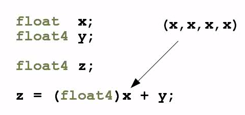

# Hello OpenCL

这一篇文章的目标是用一个最小的 `Vector Add` 示例，串联起 OpenCL 的核心流程，运行环境：

- platform：`QUALCOMM Snapdragon(TM)`
- device：`QUALCOMM Adreno(TM) 830`
- version：`OpenCL 3.0 Adreno(TM) 830`

## 1. 环境配置
宿主机需要编译环境，依赖`c/cpp`编译环境 + `Opencl头文件` + 目标设备的动态库`libOpenCL.so`：

```bash
# 安装编译环境
sudo apt update & sudo apt upgrade
sudo apt install build-essential cmake -y

# 安装 OpenCL 头文件
# 这里不建议使用apt install opencl-headers 安装头文件
# 因为这个头文件会安装到系统目录/usr/include/CL/cl.h，交叉编译可能冲突
# 这里目录位置需要自己设置对应好
git clone https://github.com/KhronosGroup/OpenCL-Headers.git

# 获取目标设备的动态库
adb -s 127.0.0.1:40404 pull /vendor/lib64/libOpenCL.so OpenCL-Headers/

```

## 2. 执行流程

这个最小示例的 Host 侧主线是：

```text
枚举 platform / device
-> 创建 context
-> 创建 command queue
-> 读取 vector_add.cl
-> build program
-> 创建 kernel
-> 创建输入输出 buffer
-> 设置参数
-> enqueue NDRange
-> 读回输出并做 CPU 校验
```
### 2.1 初始化

首先做的是获取平台和设备，然后完成运行环境的构建。

核心流程是：
```cpp
clGetPlatformIDs(0, nullptr, &platformCount); // 获取平台数量
clGetPlatformIDs(platformCount, platforms.data(), nullptr); // 选择平台
clGetDeviceIDs(platform, desiredType, 0, nullptr, &count); // 获取设备数量
clGetDeviceIDs(platform, desiredType, count, devices.data(), nullptr); // 选择设备
clCreateContext(nullptr, 1, &selection.device, nullptr, nullptr, &status); // 创建 context
clCreateCommandQueue(context.get(), selection.device, 0, &status); // 创建 command queue
```


### 2.2. 编译Kernel

示例 kernel 保持最小，每个`work item`都只计算：`c[i] = a[i] + b[i]`。

```c
__kernel void vector_add(
    __global const float* a,
    __global const float* b,
    __global float* c,
    const unsigned int n) {
  const size_t id = get_global_id(0);
  if (id < n) {
    c[id] = a[id] + b[id];
  }
}
```
接着在代码中编译这个`kernel`:
```cpp
clCreateProgramWithSource(context.get(), 1, &sourcePtr, &bytes, &status); // 创建 program
clBuildProgram(program.get(), 1, &selection.device, nullptr, nullptr, nullptr); // build program
clCreateKernel(program.get(), "vector_add", &status); // 获取 kernel
```

### 2.3 Buffer、参数绑定与执行

示例使用三块 `buffer`：

- `A`：输入向量
- `B`：输入向量
- `C`：输出向量

Host 侧会先准备 CPU 数据和参考结果，然后走下面这条链：

```cpp
// 创建 buffer 用于输入输出
clCreateBuffer(context.get(), CL_MEM_READ_ONLY, bufferSize, nullptr, &status); 
clCreateBuffer(context.get(), CL_MEM_READ_ONLY, bufferSize, nullptr, &status);
clCreateBuffer(context.get(), CL_MEM_WRITE_ONLY, bufferSize, nullptr, &status);
// 写入输入数据
clEnqueueWriteBuffer(queue.get(), bufferA.get(), CL_TRUE, 0, bufferSize,
                                     inputA.data(), 0, nullptr, nullptr);
clEnqueueWriteBuffer(queue.get(), bufferB.get(), CL_TRUE, 0, bufferSize,
                                     inputB.data(), 0, nullptr, nullptr);

// 设置 kernel 参数 这里参数对应上面kernel签名的顺序
clSetKernelArg(kernel.get(), 0, sizeof(bufferAHandle), &bufferAHandle);
clSetKernelArg(kernel.get(), 1, sizeof(bufferBHandle), &bufferBHandle);
clSetKernelArg(kernel.get(), 2, sizeof(bufferCHandle), &bufferCHandle);
clSetKernelArg(kernel.get(), 3, sizeof(elementCount), &elementCount);

// 定义 global size 和 local size， 这里需要是整数倍
clEnqueueNDRangeKernel(queue.get(), kernel.get(), 1, nullptr, &globalSize,
                        &localSize, 0, nullptr, nullptr);
// 等待 kernel 执行完成
clFinish(queue.get());
```

### 2.4 编译运行

要在`Android`上运行需要拉取目标设备的动态库，宿主机编译命令如下：

```bash
cmake -S blog/hello-opencl -B build/hello-opencl-android \
  -DCMAKE_TOOLCHAIN_FILE="$ANDROID_NDK_ROOT/build/cmake/android.toolchain.cmake" \
  -DANDROID_ABI=arm64-v8a \
  -DANDROID_PLATFORM=android-29 \
  -DOPENCL_INCLUDE_DIR="$PWD/OpenCL-Headers" \
  -DOPENCL_LIBRARY="$PWD/OpenCL-Headers/libOpenCL.so"

cmake --build build/hello-opencl-android -j4 --target opencl_vector_add
```

支持额外参数：

- `--count <N>`：设置向量长度
- `--local <N>`：设置本次运行的 `local size`


```bash
export OPENCL_DEMO_DIR=/data/local/tmp/opencl_vector_add

adb -s 127.0.0.1:40404 shell "mkdir -p $OPENCL_DEMO_DIR"
adb -s 127.0.0.1:40404 push \
  build/hello-opencl-android/opencl_vector_add \
  build/hello-opencl-android/vector_add.cl \
  /tmp/opencl-android/lib/arm64-v8a/libOpenCL.so \
  "$ANDROID_NDK_ROOT/toolchains/llvm/prebuilt/linux-x86_64/sysroot/usr/lib/aarch64-linux-android/libc++_shared.so" \
  "$OPENCL_DEMO_DIR/"

adb -s 127.0.0.1:40404 shell "
  cd $OPENCL_DEMO_DIR && \
  export LD_LIBRARY_PATH=$OPENCL_DEMO_DIR && \
  ./opencl_vector_add --kernel ./vector_add.cl --count 1024 --local 64
"
```

这次实测输出为：

```text
OpenCL vector add example
kernel_path : ./vector_add.cl
platform    : QUALCOMM Snapdragon(TM)
device      : QUALCOMM Adreno(TM) 830
device_type : GPU
device_ver  : OpenCL 3.0 Adreno(TM) 830
shape       : 1024 elements
global_size : 1024
local_size  : 64
max_abs_err : 0.000000
mean_abs_err: 0.000000
validation  : PASS
output[0:8] : -4.021429 -3.678571 -3.335714 -2.992857 -2.650000 -2.307143 -1.964286 -1.621428

CPU Baseline
stage                           time(us)
----------------------------------------
cpu_vector_add                         4

OpenCL Time Breakdown
stage                           time(us)
----------------------------------------
read_kernel_source                    41
enumerate_platforms                30794
load_platform_list                     0
select_device                          3
create_context                      2135
create_queue                           1
create_program                         3
build_program                      15383
create_kernel                          2
query_work_group                       1
create_buffer_a                        9
create_buffer_b                        3
create_buffer_c                        4
write_input_a                          7
write_input_b                          1
set_kernel_args                        2
enqueue_kernel                      8798
read_output                           24

Accuracy Comparison
cpu_reference        : fp32 vector add
opencl_vs_cpu_maxerr : 0.000000
opencl_vs_cpu_meanerr: 0.000000

Performance Comparison
cpu_baseline_us        : 4
opencl_kernel_us       : 8798
opencl_end_to_end_us   : 57211
kernel_speedup_vs_cpu  : 0.000455x
end_to_end_speedup_cpu : 0.000070x
```

### 2.5 向量类型
`opencl` 还内置了向量类型，支持 $N=\{2,3,4,8,16\}$ 的大小。使用向量类型可以让每个 `work item` 处理更多数据，并且提供类似的广播机制，如下图所示。

*图 1. 当标量 `x` 被显式转成 `float4` 时，会按 `(x, x, x, x)` 的形式广播，再与 `float4 y` 做逐元素计算。*
