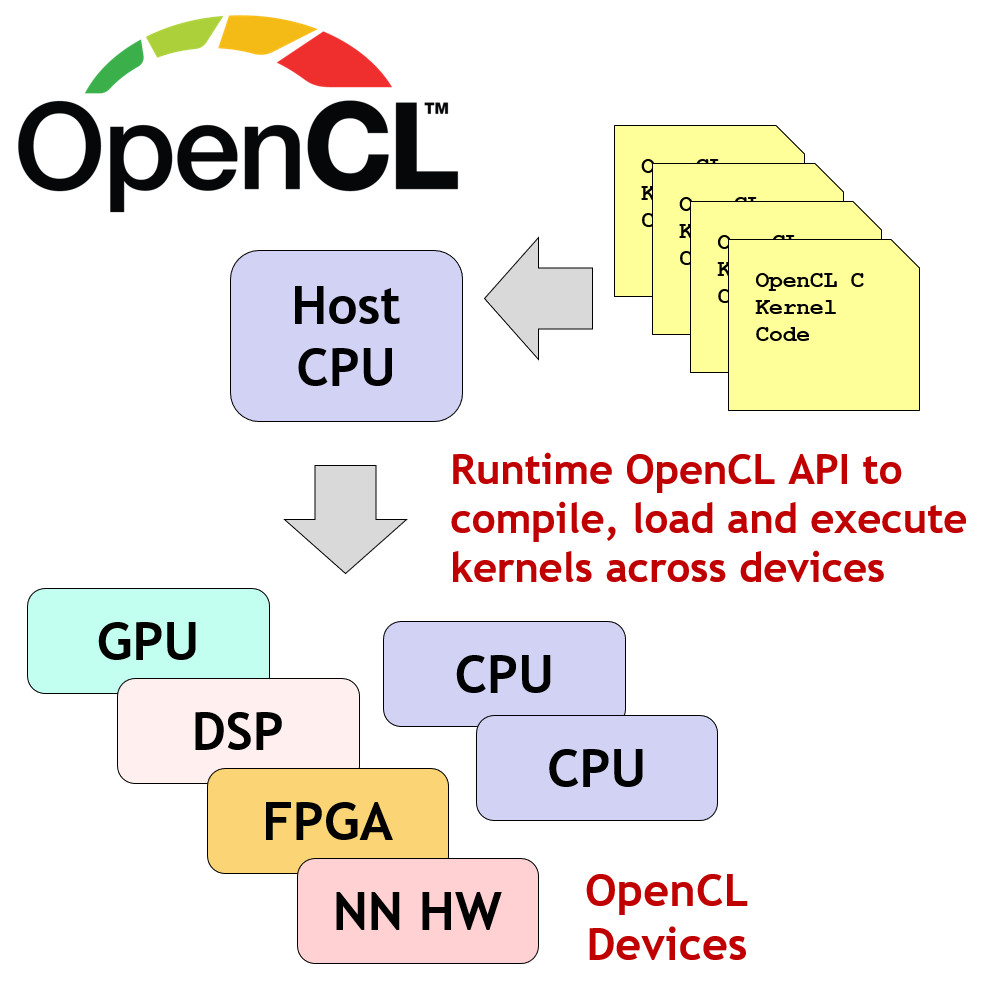
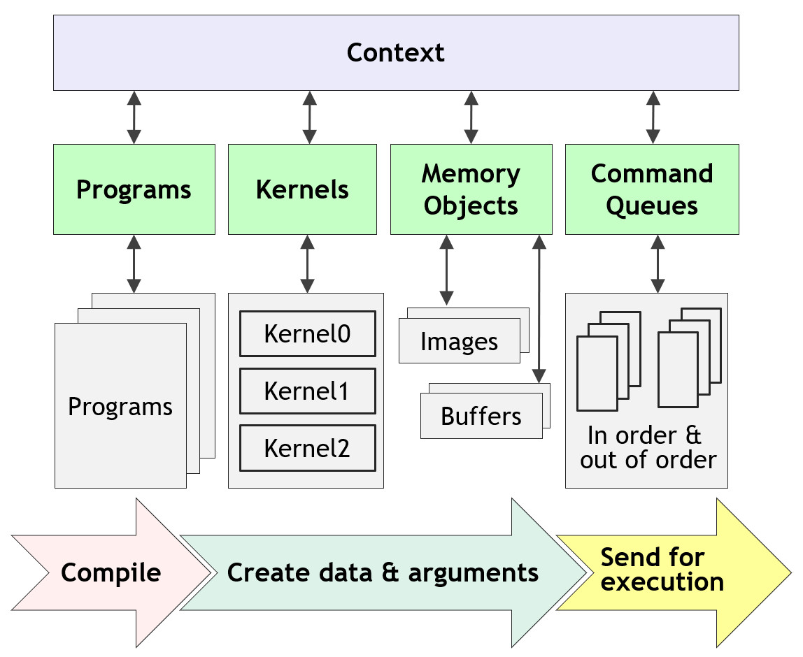
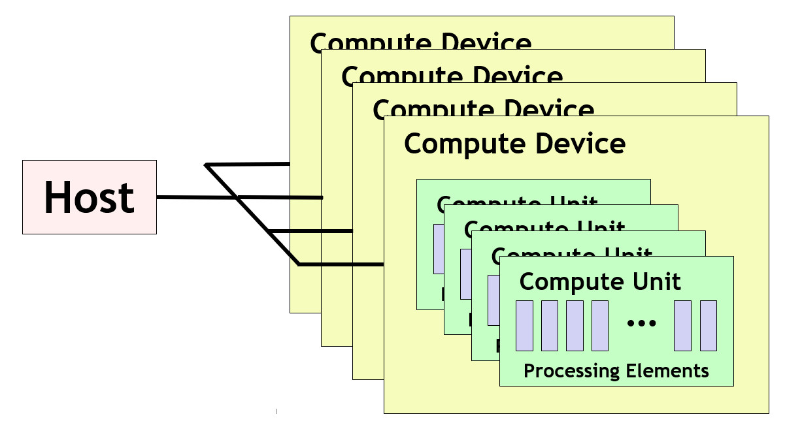
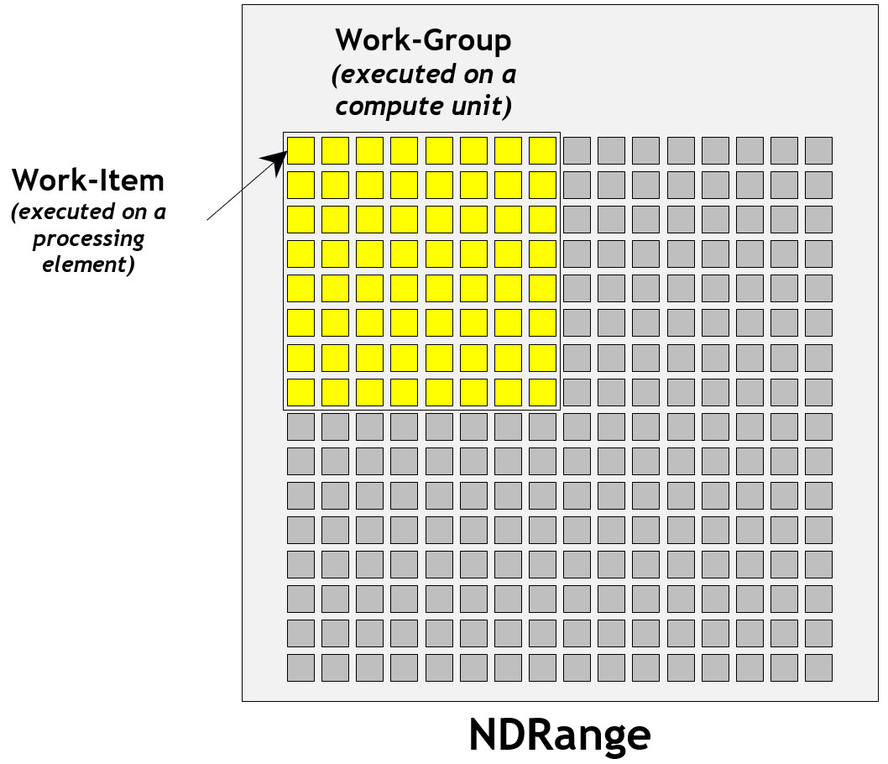
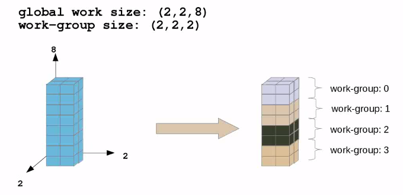
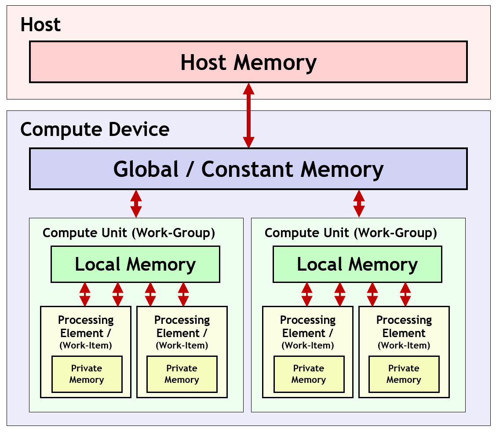

# OpenCL 介绍与执行流程

博客目标是梳理 `OpenCL` 的核心概念和执行流程，包括
- `Host` 和 `Device` 分别负责什么。
- `Platform / Context / Queue / Program / Kernel` 链路。
- `NDRange / work-item / work-group` 关系。
- `global / local / private` 内存层次。


## 1. OpenCL

`OpenCL`（Open Computing Language）是 Khronos 定义的异构计算标准。它试图提供一套统一的主机侧 API，让应用能够同时把并行计算任务提交给不同类型的设备，例如：`CPU`、`GPU`、`DSP`、`FPGA`、其他专用加速器等，可以执行跨异构平台的程序。

可以把 OpenCL 理解成两层：

- 上层是 `Host` 侧 API，用来枚举设备、创建上下文、提交命令。
- 下层是运行时和驱动，实现真正的 `Device` 上的 `kernel` 编译与执行。

不同厂商的设备提供的运行时和驱动由各厂商自己编写，但都遵守 Khronos 定义的 OpenCL 规范，结构如下图。

*图 1. OpenCL 软件栈与 `Host`、`Device` 的关系示意。*

## 2. 执行流程
### 2.1 OpenCL 执行流程

执行 OpenCL 程序的大致流程如下图，划分三个阶段：编译，资源准备，执行。

*图 2. OpenCL 程序从编译、资源准备到执行的流程示意。*

具体来说，包括以下步骤：
```text
枚举 platform
-> 选择 device
-> 创建 context
-> 创建 command queue
-> 读取 kernel 源码
-> 创建并 build program
-> 创建 kernel
-> 创建 buffer
-> 写入输入
-> 设置 kernel 参数
-> enqueue NDRange
-> 读回输出
```

### 2.2 对象概念

`OpenCL` 主要包括以下几个核心对象：
- `Context`：设备资源的宿主，大多数内存对象、程序对象和 `kernel` 生命周期都依附在 `Context` 上。
- `Command Queue`：负责把命令提交给设备，常见命令包括 `buffer` 拷贝、`kernel` 启动、同步等待。
- `Program`：对应 OpenCL C 源码或者预编译二进制。
- `Kernel`：是从 `Program` 中取出的一个可执行入口。
- `Buffer / Image`：内存对象，代表设备上的数据存储。


## 3. OpenCL 平台模型

`OpenCL` 平台模型描述了 `OpenCL` 如何理解要拓扑连接的系统中的计算资源，参考下图：

*图 3. OpenCL 平台模型中 `Host`、`Device`、`compute unit` 与处理元件的关系示意。*


主机（`Host`）连接到一个或多个 `OpenCL` 计算设备。每个计算设备（`Device`）是一个或多个计算单元的集合，其中每个计算单元由一个或更多个处理元件组成。

在 Android 场景里，常见的情况是：
- `Host` 代码跑在 CPU 上，负责准备输入数据、创建 OpenCL 对象、提交命令和读取输出结果。
- 运行时来自厂商提供的 `libOpenCL.so`，例如`SnapDragon 8 elite`的`/vendor/lib64/libOpenCL.so`
- `Device` 是手机上的 `Adreno` 或 `Mali` GPU，是真正执行 kernel 的设备

## 4. OpenCL 执行模型

`OpenCL` 的执行模型，是一个基于 `NDRange` 的数据并行模型。主机侧通过 `clEnqueueNDRangeKernel` 命令，把同一个 `kernel` 入口在一个 `N` 维索引空间上并行启动。这个索引空间就叫 `NDRange`，可以是一维、二维或三维。

以二维图像举例，如下图：

- 整张图像的宽和高，构成这次执行的 `NDRange`
- 图像中的每一个像素，可以看成一个 `work-item`
- 每个 `work-item` 都会执行同一份 `kernel` 代码，只是通过自己的索引访问不同的数据位置


*图 4. OpenCL 执行模型中 `NDRange`、`work-item` 和 `work-group` 的关系示意。*

从硬件角度看，处理器通常不会把所有处理元件平铺成一个大集合，而是会先把它们组织成一个个 `compute unit`。这样可以提高调度效率和资源利用率，设计局部共享资源。因此，`OpenCL`把一批连续的 `work-item` 分成一个组:

- `work-item`：最小执行单位，对应一次 `kernel` 副本
- `work-group`：一组可以协同工作的 `work-item`，大小是`work-group size`
- `compute unit`：设备上负责调度和执行一个或多个 `work-group` 的硬件执行单元

同一个 `work-group` 内的 `work-item` 具备：
- 共享 `local memory`
- 通过 `work-group barrier` 做组内同步
- 使用 `async_work_group_copy` 这类 `work-group` 级函数高效搬运数据
  
而不同 `work-group` 之间更加独立，通常通过 `global memory` 间接通信。所以，opencl先定义数据空间，再把空间里的每个元素映射成 `work-item`，最后根据硬件特性决定 `work-group size`。 

例如一个三维数据大小是 `(2, 2, 8)`，按照 `(2, 2, 2)` 的 `work-group size` 来执行，那么就会有 4 个 `work-group`，每个 `work-group` 里有 8 个 `work-item`，总共 32 个 `work-item` 来处理这 32 个数据元素。

*图 5. 一个 `(2, 2, 8)` 的 `NDRange` 按 `(2, 2, 2)` 的 `work-group size` 切分后的分组示意。*

## 5. 内存模型

OpenCL 有一个内存类型的层次结构，不同内存都不会自动同步，需要在内存类型之间显式移动数据，如图

*图 6. OpenCL 内存层次结构示意。*
其中，
- 主机内存： 可供主机CPU使用
- 全局/常量内存： 可用于计算设备中的所有计算单元
- 本地内存： 可供计算单元中的所有处理单元使用
- 专用内存：可供单个处理单元使用

## 6. 参考资料

- [OpenCL API Specification](https://registry.khronos.org/OpenCL/specs/)
- [Khronos OpenCL Guide](https://github.com/KhronosGroup/OpenCL-Guide)
- [Arm Guide to OpenCL Programming](https://developer.arm.com/-/media/developer/Graphics%20and%20Multimedia/Developer%20Guides%20-%20PDFs/Arm%20Guide%20to%20OpenCL%20Programming.pdf?la=en&revision=44b43b2c-dc81-4ef6-96dd-5ead4da5dbf2)
- [Qualcomm OpenCL Programming](https://docs.qualcomm.com/bundle/publicresource/80-NB295-11_REV_C_Qualcomm_Snapdragon_Mobile_Platform_Opencl_General_Programming_and_Optimization.pdf)
- [OpenCL GitBook Introduction](https://leonardoaraujosantos.gitbook.io/opencl/chapter1)
