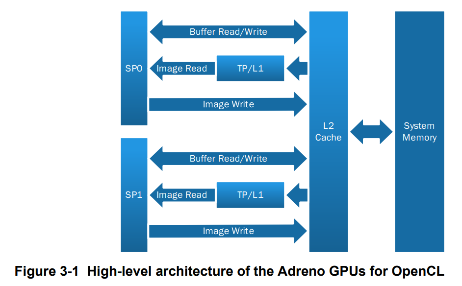

# Qualcomm OpenCL

基于 Qualcomm 官方 [OpenCL General Programming and Optimization](https://docs.qualcomm.com/doc/80-NB295-11/80-NB295-11_REV_C_Qualcomm_Snapdragon_Mobile_Platform_Opencl_General_Programming_and_Optimization.pdf) 文档，梳理要点。

## 1. Andreno GPU架构

高通的`Soc`里集成的`GPU`是`Adreno GPU`，其的架构设计围绕着高效的并行计算和内存访问展开，如图

*图 1. Adreno GPU 在 `OpenCL` 场景下的高层架构：`SP` 通过 `L2 cache` 访问 `buffer` 和系统内存，只读 `image` 读取会经过 `TP/L1` 路径。*

架构图中核心的组件包括：
- `SP`：`Shader Processor`(流式处理器)，是执行 `OpenCL kernel` 的核心计算块，里面有 `ALU`、寄存器、访存单元、控制流单元等。
- `TP/L1`：纹理处理与**只读** `L1 cache` 路径。
- `L2 cache`：缓冲区读写、image 写入等。

### 1.1 fiber、wave

高通的底层硬件命名对应关系如下：

```text
执行work-item的Procession Elements  ~= fiber
执行subgroup的Compute Unit ~= wave
```

其中：
- `wave size` 不是固定常数，它和 `Adreno` 代际、档位以及编译结果有关。
- 对某个已经编译好的 kernel，`wave size` 是固定的。
- `SP` 可以同时容纳多个活跃 `wave`，不同`wave` 相互独立

### 1.2 特性
- 高优先级会抢占`GPU`,这一步的上下文切换代价很大，最好避免频繁发生。
- 长时间的内核计算会导致`GPU`重启，内核的执行时间最好控制在几十毫秒以内。

## 2. 优化

### 2.1 api开销

下面几个api的调用开销比较大：

- `clCreateProgramWithSource()`
- `clBuildProgram()`
- `clLinkProgram()`
- `clUnloadPlatformCompiler()`

应该尽量：
- 程序启动阶段就完成 `program` 创建和 build
- 复用 `context`、`queue`、`buffer / image`
- 避免在 kernel 调用之间频繁创建和释放内存对象

同时优先考虑：

- 预编译二进制 kernel
- 加载二进制失败时，再 fallback 到源码 build

另外，如果平台支持零拷贝路径，尽量避免 Host 侧额外 copy；在 Android 体系里，这类调用通常会落到 `ION` 或 `ALLOC_HOST_PTR` 一类用法上。

### 2.2 数据依赖

`OpenCL enqueue` 接口允许传入依赖事件列表，并且发出事件来标记命令完成，可以通过事件列表实现数据依赖，通过回调函数实现事件处理，一个小示例如下：

```text
enqueue A, emit event A
-> enqueue B, wait event A
-> enqueue C, wait event B
-> 最后在真正需要结果时再同步
```


### 2.3 默认用 in-order queue

`Adreno` 支持 `out-of-order command queue`，但 `in-order queue` 的依赖管理更适合流水线命令

### 2.4 Kernel 优化

#### 2.4.1 work-group size 和 shape
`Adreno` 上的 `work-group size` 不适合拍脑袋定，先查当前 `kernel` 的上限：

```cpp
size_t maxWorkGroupSize = 0;
clGetKernelWorkGroupInfo(
    kernel,
    device,
    CL_KERNEL_WORK_GROUP_SIZE,
    sizeof(size_t),
    &maxWorkGroupSize,
    nullptr);
```

然后再注意三点：

- 不要默认相信运行时自动选出来的 `local size`
- `reqd_work_group_size` 和 `work_group_size_hint` 不要滥用
- 如果 kernel 对固定 `work-group` 没有语义依赖，最好把调优权留给运行时和实测

更直接一点说：

- `work-group` 太小，`SP` 很容易吃不满
- `work-group` 太大，寄存器和本地资源压力会上去
- 真正能跑得快的，通常是和当前 `kernel` 访存模式、寄存器占用一起匹配出来的大小

文档里还特别提醒了一点：

- 如果你把 `work-group size` 写死，编译器为了满足这个限制，可能会增加寄存器 spill
- 看起来更“可控”，最后反而更慢

所以更稳的顺序是：

```text
先查上限
-> 再试几个候选 local size
-> 最后保留实测最快的配置
```

#### 2.4.2 读多写少、二维局部性强时，优先 image

在 `Adreno` 上，`image` 的优势主要来自：

- 只读 `L1` 路径
- 纹理硬件本身的访存优化
- 越界读自动处理
- 内建插值能力

所以如果数据满足下面这些特征，可以先试 `image2d_t` 或 `image3d_t`：

- 主要是只读
- 按二维或三维邻域访问
- 边界处理麻烦
- 需要采样或插值

但 `buffer` 并没有过时，它仍然更适合：

- 需要指针式灵活寻址
- 核心路径里需要读写同一对象
- image 的像素粒度限制反而束缚了数据布局
- `L1 cache` 本身成了瓶颈

换成更实用的判断方式就是：

- 热点只读小数据，优先放到 image / sampler 路径
- 大块可写结果和灵活布局，继续走 buffer 路径

#### 2.4.3 用 128-bit 访存吃带宽

Qualcomm 文档对向量化访存写得很明确，原因也很直接：`Adreno` 支持到 `128-bit` 的全局/本地/image 访存事务。

所以对明显 `memory-bound` 的 kernel，先看这几件事：

- 能不能把标量 load/store 改成 `vload4 / vstore4`
- image 能不能使用 `RGBA + float / int32 / uint32 / half`
- 地址是否至少做到 `32-bit` 对齐

这里有一个很容易踩的坑：

- 单个 work-item 装太多数据，会增加寄存器压力
- 寄存器压力升高，又会降低活跃 wave 数量

所以“向量化”不是让一个 `work-item` 一直加活，而是：

- 先让一次访存尽量搬够数据
- 再控制住寄存器占用

这一步本质上是在带宽利用率和并发 `wave` 数量之间找平衡。

#### 2.4.4 `constant memory` 和 `local memory` 都要挑场景

`constant memory` 在 `Adreno` 上值得用，但前提是数据真的满足“常量、小、最好还能广播”。

最适合 `constant memory` 的情况是：

- 系数表、查找表、滤波器 tap
- 同一个 subgroup 或 work-group 里的 work-item 经常读取同一项

因为这种访问模式可以让数据更像广播一样喂给 `ALU`，成本会比从别的内存层反复取低很多。

`local memory` 则要更保守一些。Qualcomm 文档明确说了：

- 它不一定能带来加速
- 如果数据只用一次，local memory 反而可能拖慢
- barrier 很贵
- subgroup 的 reduction / shuffle 往往比“搬到 local 再同步”更划算

所以更稳的做法是：

- 数据会被同组多个 work-item 重复使用多次，才考虑 local memory
- 只是想做组内交换或归约，优先先试 subgroup 函数
- 如果 local memory 用得很多，还要当心它限制并发 work-group 数量，破坏 latency hiding

#### 2.4.5 `16-bit`、`fast math`、`native math` 是第一批该试的 ALU 优化

如果瓶颈已经偏向计算侧，Qualcomm 文档给的优先级也很清楚：

- 先试 `FP16`
- 再试 `-cl-fast-relaxed-math`
- 再针对热点函数换 `native_*`

原因分别是：

- `FP16` 在 `Adreno` 上通常有更高吞吐，同时内存带宽减半
- `fast math` 会放松精度约束，换取更快实现
- `native_*` 直接走硬件原生实现，适合对精度不特别敏感的图像、视频、视觉类 workload

如果业务不能接受 `FP16` 计算误差，也可以做折中：

- 存储和加载用 16-bit
- 计算阶段仍然提升到 32-bit

这样至少先把带宽压力降下来。

#### 2.4.6 `size_t`、分支发散和 Host-GPU 传输是常见坑

除了前面的优化项，文档里还有几类很容易忽略但很影响结果的问题。

先是 `size_t`。在 64-bit 系统上，kernel 里的 `size_t` 很可能会被当成 64-bit long 处理，而 `Adreno` 需要用两个 32-bit 寄存器去模拟：

- 寄存器占用会上升
- 活跃 `wave` 数量会下降
- 可选 `work-group size` 也会更受限制

所以 kernel 里能用 `int`、`uint` 的地方，尽量不要随手上 `size_t`。

再一个是分支发散。同一个 `wave` 里的 work-item 如果走不同控制流，执行就会被 mask，吞吐会明显掉下来。所以更稳的方式是：

- 让行为相近的数据尽量落在同一批 work-item 上
- 能用 `select()` 或简单表达式改写的分支，尽量别写成重控制流
- 边界逻辑特别复杂时，宁可单独拆一个 kernel

最后是 Host 和 GPU 之间的数据传输。如果端到端时间已经主要耗在搬运上，优先级通常比继续抠 ALU 还高。文档给的方向是：

- 优先考虑 `zero-copy`
- 能 `map/unmap` 的场景尽量别多做一次 `copy`
- 创建内存对象时可以考虑 `CL_MEM_ALLOC_HOST_PTR`

很多“GPU kernel 不慢，但整体就是不快”的问题，最后根因都在这里。

### 2.5 还有哪些坑值得提前记住

#### 2.5.1 只有 global memory 适合跨 kernel 传数据

Qualcomm 文档对内存生命周期说得很明确：

- `local memory` 的内容只活到当前 work-group 结束
- `private memory` 只属于当前 work-item
- `constant memory` 也不能假设下一次 kernel 还能复用上一次内容
- 真正能稳定跨 kernel 传递内容的，是 host 创建出来的 `buffer / image`

所以不要把“上一个 kernel 写到 local 里，下一个 kernel 接着读”当成可用模型。跨 kernel 传数据，还是得回到 global memory objects。

## 3. 一个更实用的排查顺序

如果你现在已经有一个 `Adreno` 上能跑的 OpenCL kernel，排查顺序建议是：

1. 先判断瓶颈是 `memory-bound` 还是 `ALU-bound`。
2. 如果偏内存瓶颈，优先试 `image`、`vload4/vstore4`、连续访问、`FP16` 存储、`constant/local` 重排。
3. 如果偏计算瓶颈，优先试 `FP16`、`fast math`、`native_*`、减少分支和控制流。
4. 每做一轮改动，都重新调 `work-group size/shape`。
5. Host 侧避免阻塞和重复 build，别让 CPU 把 GPU 发射节奏拖慢。
6. 不要把一台 `Adreno` 上的最优参数直接当成“所有设备通吃”的常数。

如果手头有 `Snapdragon Profiler` 或等价工具，优先把 kernel 时间、Host API stalls、缓存压力这几类指标先看明白，再决定调优方向。

## 4. 参考资料

- [Qualcomm OpenCL General Programming and Optimization](https://docs.qualcomm.com/doc/80-NB295-11/80-NB295-11_REV_C_Qualcomm_Snapdragon_Mobile_Platform_Opencl_General_Programming_and_Optimization.pdf)
- [OpenCL API Specification](https://registry.khronos.org/OpenCL/specs/)

## 7. 参考资料

- [Qualcomm Snapdragon Mobile Platform OpenCL General Programming and Optimization](https://docs.qualcomm.com/doc/80-NB295-11/80-NB295-11_REV_C_Qualcomm_Snapdragon_Mobile_Platform_Opencl_General_Programming_and_Optimization.pdf)
- [OpenCL API Specification](https://registry.khronos.org/OpenCL/specs/)
